# Banking Fraud Detection

**Author:** Sayak Chowdhury  
**Project for:** UCO Bank Hackathon, IIEST Shibpur

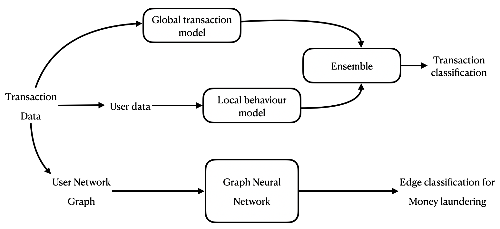
*Figure: Project banner illustrating the fraud detection pipeline.*

---

## Problem Statement

Detect fraudulent transactions and accounts in banking systems, focusing on **money laundering** patterns such as:

- Fan-in / Fan-out
- Directed Biclique / Directed Cycle
- Scatter-Gather / Gather-Scatter

**Account takeovers** may occur via:
- Phishing
- Credential stuffing
- Malware
- Social engineering
- Data breaches
- SIM swapping
- Man-in-the-middle attacks

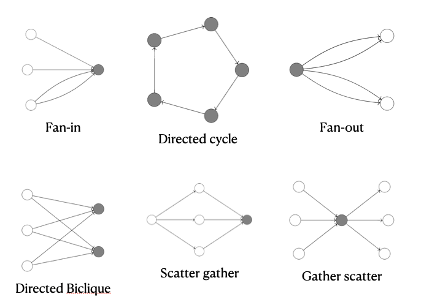
*Figure: Visual representation of common fraud and money laundering patterns.*

---

## Dataset

- **Fraud Detection:** BANKSIM (0.5% fraud rate)
- **Money Laundering:** IBM AML datasets

> *Note: Data is highly imbalanced and sparse, making detection challenging.*

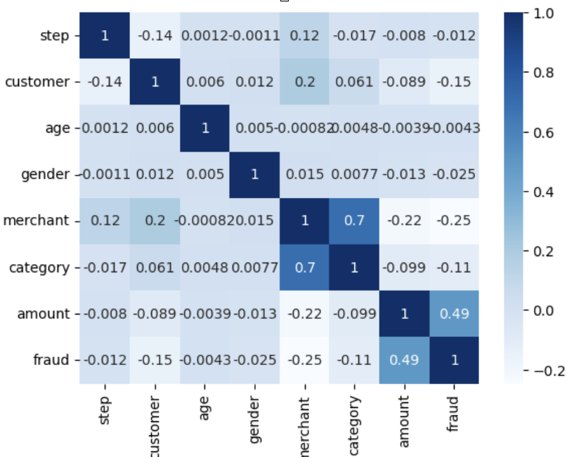
*Figure: Correlation heatmap of dataset features.*

---

## Objectives

- Detect fraud in sparse, imbalanced datasets
- Efficient behavioral recognition
- **Metric:** F1-score (balances precision & recall; better than accuracy for imbalanced data)
- **Real-time inference:** < 100 ms

---

## Proposed Solution

An ensemble approach combining:
- **Global transaction models**
- **Local behavior models**
- **Graph Neural Networks (GNNs)**

*Figure: High-level architecture of the proposed solution.*

- **Edge classification for money laundering:** GIN, GAT
- **Transaction classification:** Global Model + various local models

---

## Model Versions & Observations

### Version 1: Global Model + Dynamic LOF

- **Global Model:** Uses all historical data for each transaction
- **Dynamic LOF:** User-specific novelty detection (KNN-based, time-consuming)

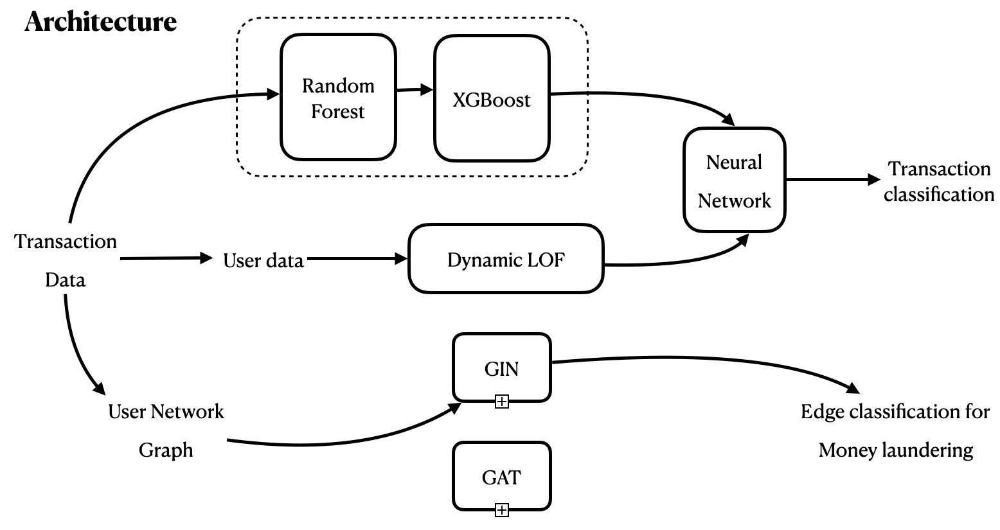
*Figure: Architecture diagram for Version 1.*

**Results:**
- Precision: 0.90 | Recall: 0.90 | F1-score: 0.90 | Accuracy: 1.00

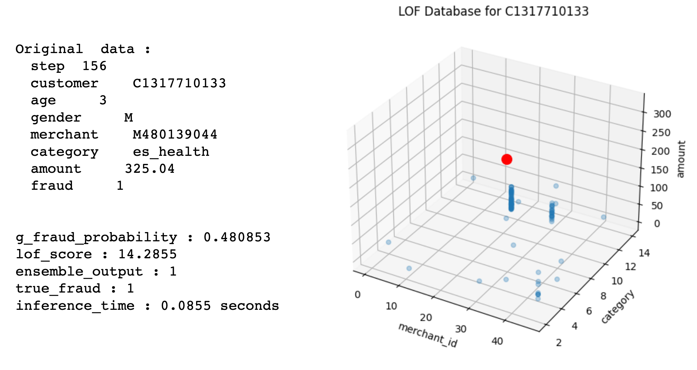
*Figure: Output metrics for Version 1.*

**Disadvantages:**
- **High computational cost:** Dynamic LOF relies on KNN, making it slow and unsuitable for real-time applications.
- **Scalability issues:** As data grows, performance degrades significantly.
- **Not practical for deployment:** Real-time constraints are not met.

---

### Version 2: Global Model + Historical Transformer

- Uses limited recent transactions for prediction (lower computation)
- Struggles with behavioral changes and rare patterns

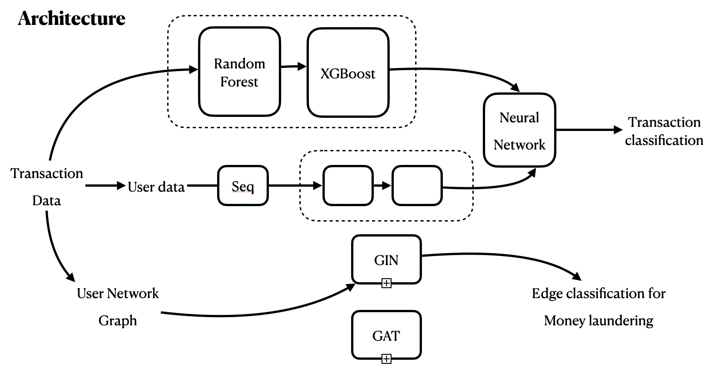
*Figure: Architecture diagram for Version 2.*

**Results:**  
Lower F1-score(0.89) due to limited context

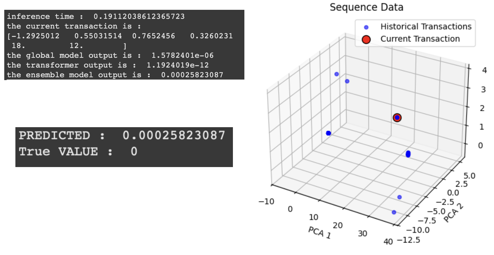
*Figure: Output metrics for Version 2.*

**Disadvantages:**
- **Limited context:** Only recent transactions are considered, missing long-term behavioral patterns.
- **Poor adaptability:** Fails to detect rare or evolving fraud strategies.
- **Reduced accuracy:** Lower F1-score due to insufficient historical data.

---

### Version 3: Global Model + Relevance Transformer

- Selects relevant historical transactions using a relevance score
- Handles rare patterns better

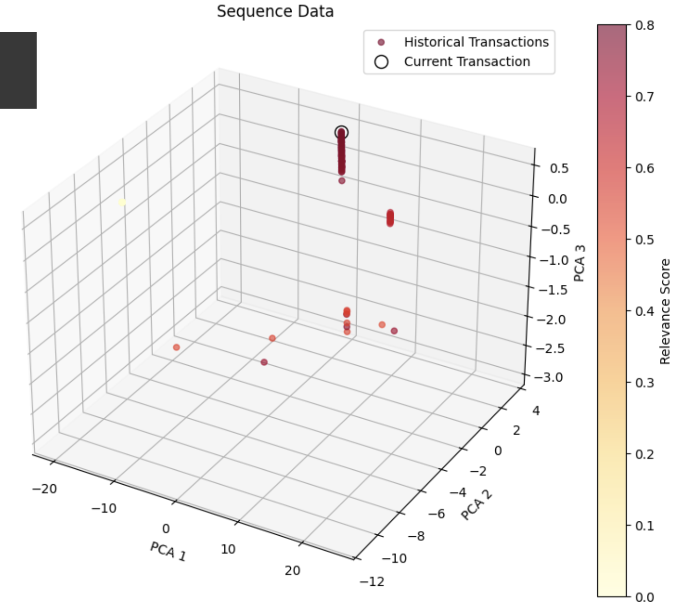
*Figure: Output metrics for Version 3.*

**Results:**
- Precision: 0.93 | Recall: 0.88 | F1-score: 0.90 | Accuracy: 1.00

**Disadvantages:**
- **Struggles with unseen behaviors:** While rare pattern detection is improved, the model still cannot generalize well to entirely new customer behaviours.
- **Complexity:** Relevance scoring adds computational overhead.

---

### Version 4: Global Model + Neighbor Relevance Transformer

- Transformer sequence includes: current transaction, self-history, and neighbor history (from geospatial proximity)
- Uses relevance and neighbor masks
- Sequence length: (1 + k + f*n)  
  (1 current + k self-history + f neighbors × n neighbor-history)
- each row in the sequence will contain relevance score
- each row will also include aggregated neighbor mask.

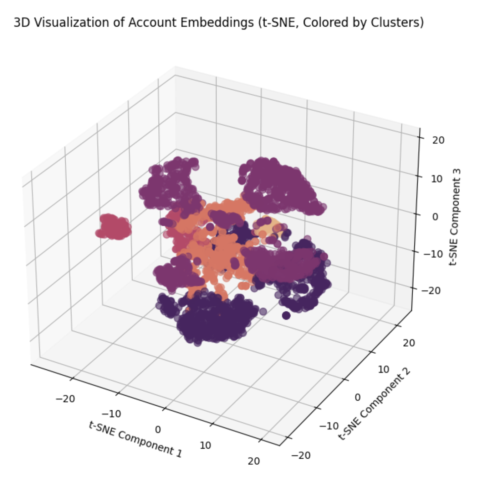
*Figure: Visualization of transaction neighborhood and proximity.*

- Improved recognition of rare behaviours
- Should improve generalization to unseen behaviors
- Computationally expensive; experiment paused due to hardware constraints

---

## Graph Neural Networks

- **Message Passing Neural Networks:**  
  \[
    \mathbf{h}_v^{(l+1)} = f(\mathbf{h}_v^{(l)}, \bigoplus_{u \in \mathcal{N}(v)} g(\mathbf{h}_u^{(l)}, \mathbf{e}_{uv}))
  \]
- **Graph Isomorphism Network (GIN):**  
  Experiment paused (hardware constraint).  
  Trainable params: \(4.5 \times 10^5\)  
  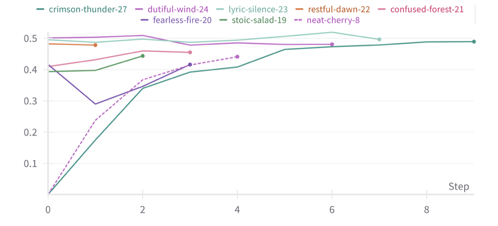
  *Figure: GIN training loss and accuracy curves.*

- **Graph Attention Network (GAT):**  
  Experiment paused (hardware constraint).  
  Trainable params: \(4.5 \times 10^5\)  
  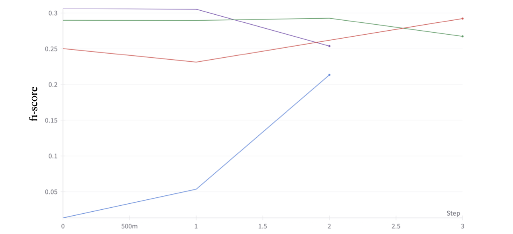
  *Figure: GAT training loss and accuracy curves.*

---

## Conclusion

- Leveraged behavioral features for fraud detection
- Balanced precision and recall for imbalanced data
- Achieved real-time inference constraints (where feasible)

---

## Acknowledgements

- "How Powerful are Graph Neural Networks?" — X. Ying, Y. Zhang, K. Cui
- "Graph Attention Networks" — Petar Veličković et al.
- "GraphSAGE" — Will Hamilton et al.
- "Provably Powerful Graph Neural Networks for Directed Multigraphs" — Béni Egressy et al.
- Stanford CS224W (Graph Neural Networks)
- Scikit-learn, River, XGBoost, PyTorch, PyTorch Geometric
- Kaggle (datasets), ArXiv, Google Scholar